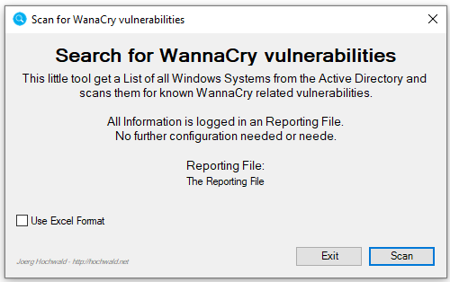
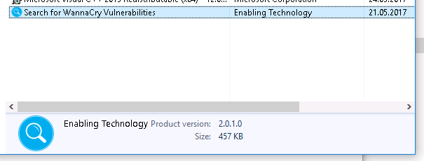

# Who needs WannaCry related patches

This is the executable version of my PowerShell Script, with a very basic UI.

In general, there is no big difference to the [Gist](https://gist.github.com/jhochwald/666a0b51f2d13d62e63c9e4200168793) I published a few days ago. This is a compiled PowerShell Script, and I added the Report File creation.

## Main Screen

There is nothing to configure. The Report is a plain ASC Text File that is created where the executable is.

## Run

This might take a while. The Time depends upon the number of computers found in the Active Directory and your Network Performance!

## Report Format

Again: This is just a plain ASC File! First, I started with a CSV File, but based upon a request I changed that to a plain Text file.

### Naming Convention
The Name of the Report is: **HotfixReport-** and there is the following Date String appended to each run: `yyy-mm-dd-hhmm`. The extension is `.txt`.

#### Example
`HotfixReport-2017-16-16-0316.txt`
That File is generated on May, 16th 2017 at 3:16.

### Content
We talk about a very basic report here. I just implemented a limited number of text strings.

#### Good Case
`$computer has hotfix $hotfix installed`

#### Bad Case
`$computer is missing WannaCry hotfix`

#### Problem
`Unable to get Hostfix Info from $computer`

## Installation (Optional)
I created a very simple MSI installer! No fancy options, nothing!
The Installer will deploy the Executable to the following Path by default:
`C:\Program Files (x86)\Enabling Technology\Who needs WannaCry related patches`

You do not need to install the Tool! If you copy the Executable and start it, this is just fine! The Installer is more for convenience only. I know that some prefer to have a working installer for every tool.

### Check

## General

### Requirements
There are a few requirements!
* The Tool must be elevated (**Run as Administrator is the default**)
* The RSAT Tools must be installed. Install it via Server Manager (Server) or Download (Client). Just Google for "*Windows RSAT*"
* The Computer that should run the scan needs to be Domain joined
* The permissions needs to fit!
* Remote PowerShell must be enabled: `$null = (Enable-PSRemoting -Force)` (*Execute this on the REMOTE systems*)
* The remote system should allow Remote Management (Check the ‘*Windows Remote Management*’ Rule)
* PowerShell 4.0, or newer needs to be installed
* Windows 7, or newer are required. Or Windows Server 2008R2, or newer.

I tested the Script ([Gist](https://gist.github.com/jhochwald/666a0b51f2d13d62e63c9e4200168793)) abd this Tool only on Windows 10 based Clients and Windows Server 2016 based Servers. I never tested it on any other OS! I should run :-)

### Source Code
**I decided not to publish the code!**
But again: The logic is based on the [Gist](https://gist.github.com/jhochwald/666a0b51f2d13d62e63c9e4200168793) I published. The only missing part is the UI.

#### Customization?
This is not planned. If you honestly need any kind of customization, you will have to spend a few $!!! Contact me if this is sincerely needed. However, I think the general approach should fit in almost any cases!
And if not: Use the Script. You can customize whatever you like.

### Signed
The Executable and the Installer are signed with a valid certificate. So there shouldn't be any problems with virus scanners or the execution/installation.

### Why this tool
Because the WannCryt aka WannaCry problem isn't solved and there are still unpatched systems. 
And some didn't (why ever) like Powershell!

### Why Free
Why not? Sometimes it feels great if you can help others. And it's not all about the Benjamin's all the time :-)

#### Donations
If you want to give something back, donate something to a good charity organization. On the other hand, buy me a drink if we ever meet :-)

### Warranty
The code is provided 'as is,' with all possible faults, defects or errors, and without warranty of any kind.

### Copyright
(c) 2017 by Joerg Hochwald - [hochwald.net](http://hochwald.net)

### License
This tool, like the script, is general public domain. Even if I decided to keep the source closed. 
